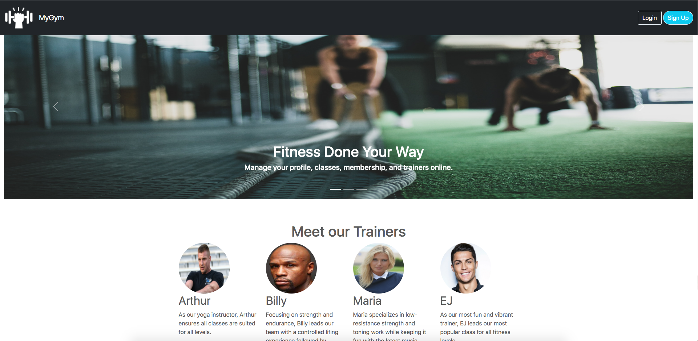
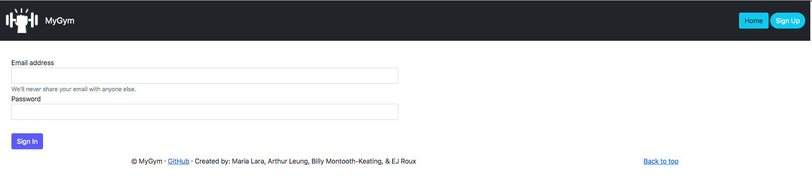
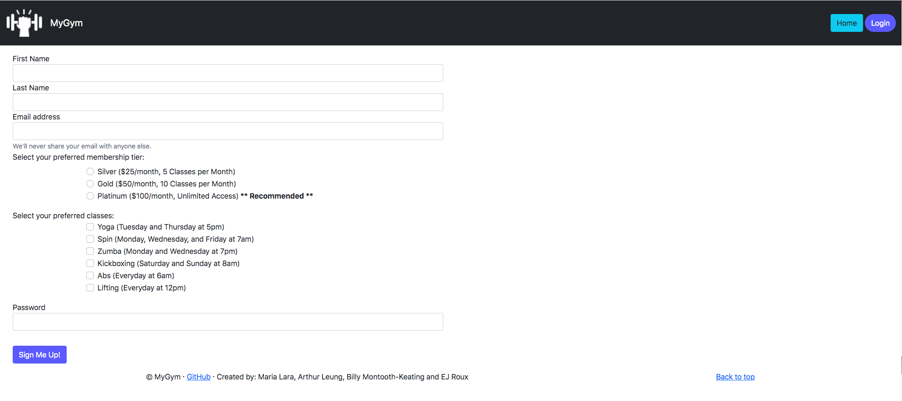
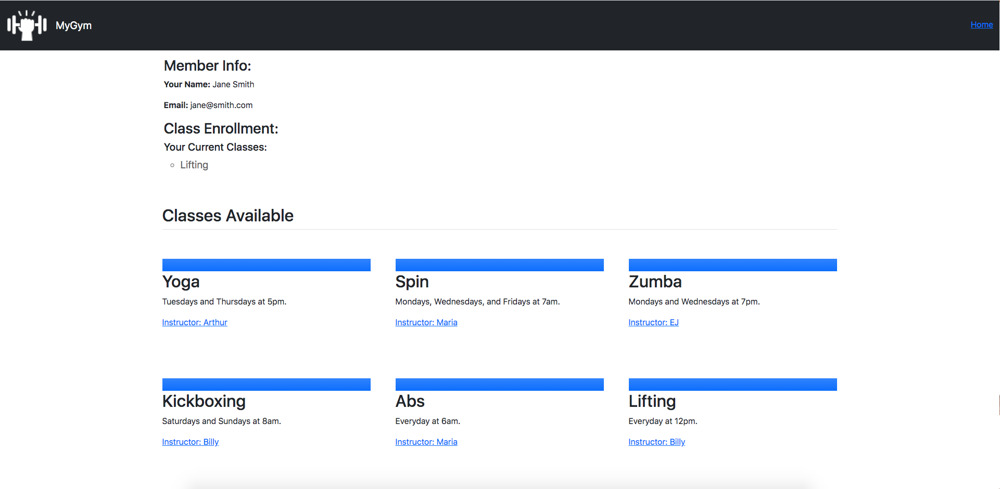

# MyGym

## Description

For this project, we created a Gym Database Management application. This application manages a number of tables through Sequelize and MySQL2 which relate to the data types we expect a typical gym to utilize, including members, membership tiers, trainers, and gym classes. The front end of our application serves as an interface for gym administrators to manage information about the gym, as well as an online portal for gym members to sign in and register for classes or change their membership tier. The back end of our application utilizes a RESTful API to perform `GET`, `POST`, `DELETE`, and `PUT` requests on the information, as requested by front end input. Our folder structure was built around the MVC paradigm, to ensure smooth development between the four collaborators on this project. Additionally, we practiced agile project management to help ensure that we kept pace with our development timeline.

## Table of Contents

- [Installation](#installation)
- [Usage](#usage)
- [Contributing](#contributing)
- [Tests](#tests)
- [Questions](#questions)
- [License](#license)
- [Screenshots](#screenshots)

## Usage

To use our project, you can create an account at our deployed link above and view our example gym page as a member. For access to the full application using your own data, contact us on GitHub.

## Installation

Our application can be accessed through Heroku by visiting the following link: https://intense-springs-12278.herokuapp.com/

## Contributing

To learn how to contribute to this project, contact us on GitHub.

## License

This application is covered under the MIT License.

## Questions

For questions, reach us via GitHub or by email.

Github: [Artydabomb](https://github.com/Artydabomb), [maria-lara](https://github.com/maria-lara), [eroux13](https://github.com/eroux13), [Billy-MK](https://github.com/Billy-MK)

Email: arthur.leung3@gmail.com, melara@ucdavis.edu, ej.roux13@gmail.com, wmontoothkeating@gmail.com

## Screenshots

Home Page

Login & Sign Up Page

Member Dashboard

